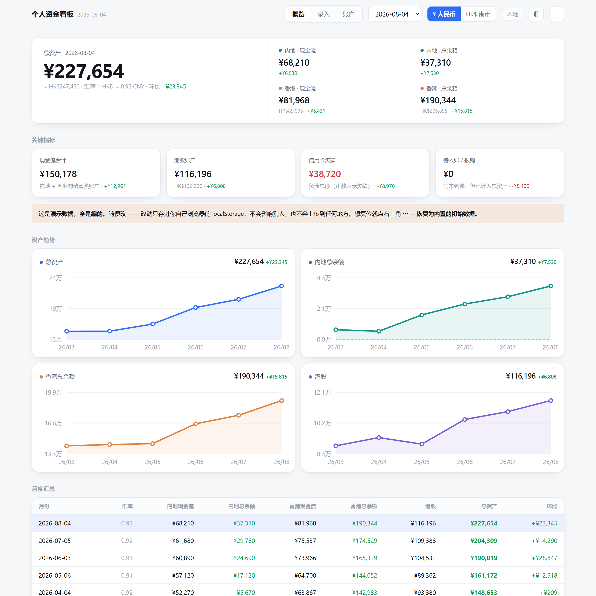
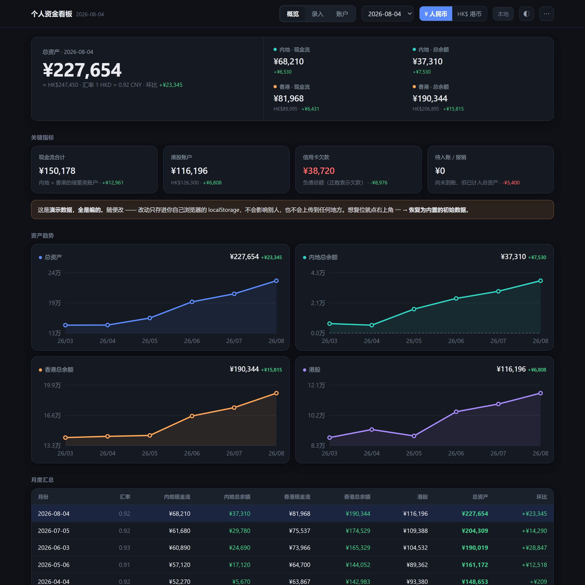
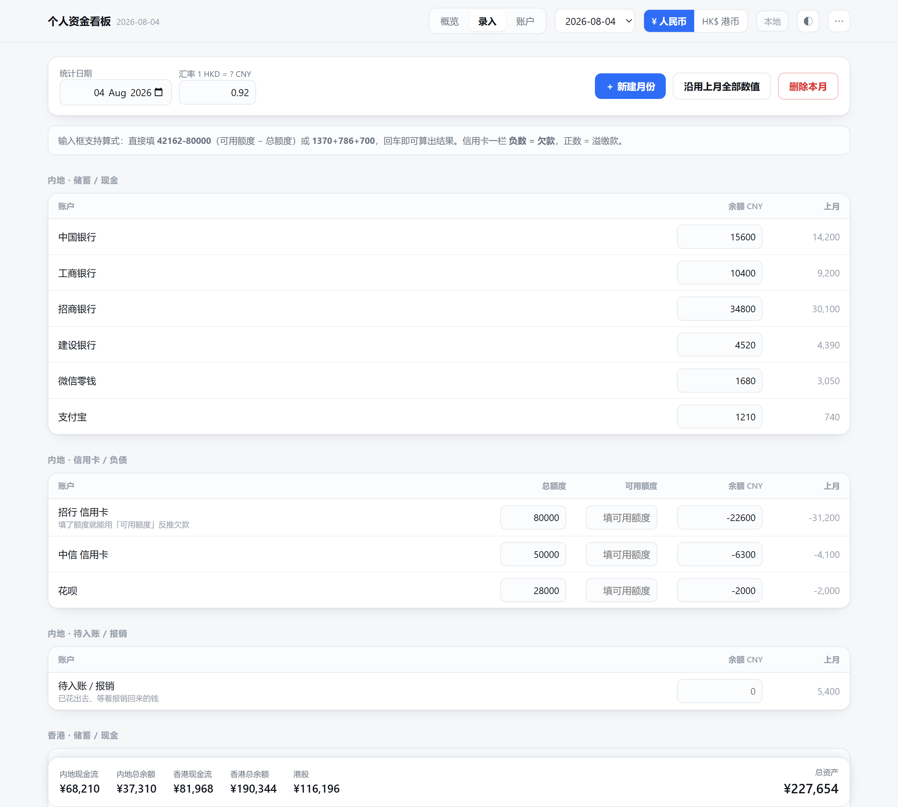
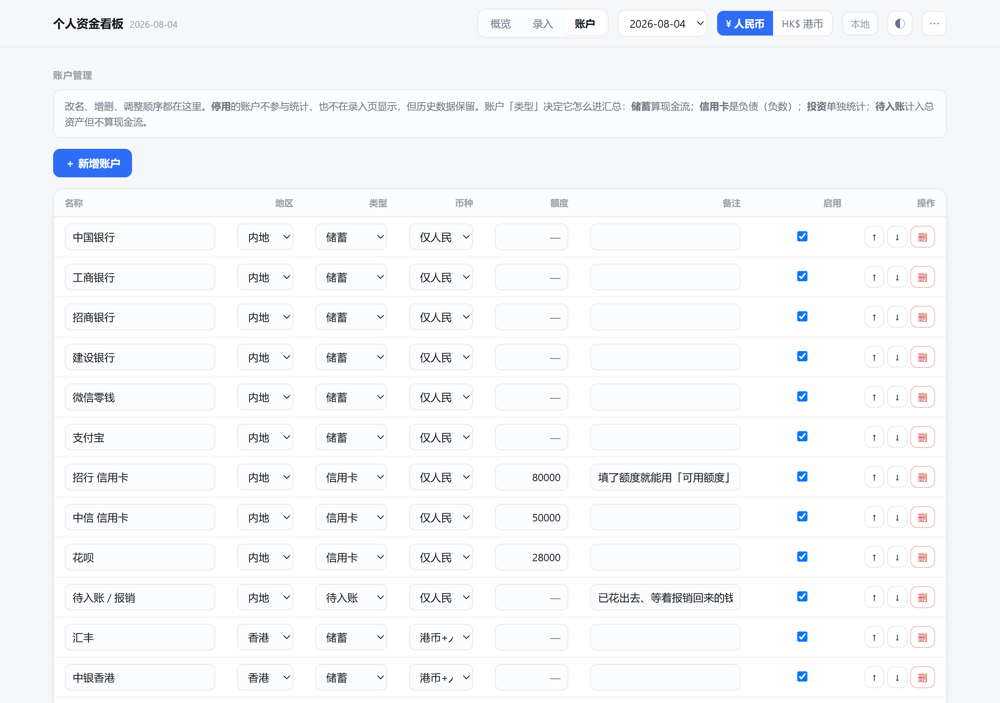

# 个人资金看板

每月记一次**中国内地 + 中国香港**各银行账户余额、信用卡欠款和港股市值，
按汇率自动折算，看到两地各自的**现金流余额**、**总余额**，以及一个**个人总资产**。

**[▶ 在线演示](https://ma-wenqian.github.io/finance-dashboard/)**（演示数据全是编的，随便改，只存你自己的浏览器）



---

## 这是给谁的

如果你满足以下几条，这个东西大概正合适：

- 钱分散在**两地**：内地几张卡 + 香港几个户口，还有信用卡欠款要抵扣；
- 一个月只想记**一次**，不想记流水账；
- 香港的账户里**同时有港币和人民币**（很多港卡是这样），要合并折算；
- 有个港股账户，市值**手动填**就行，不需要实时行情；
- 数据必须**在自己手里** —— 要么就在本地浏览器，要么在自己的服务器上。

## 特点

- **零依赖**。没有 npm 包，没有构建工具链，没有原生模块。前端是一个 HTML 文件，后端只用 Node 内置模块。
- **两种用法**，同一份代码：双击 HTML 本地用，或部署到自己的服务器登录用。启动时探测后端，探不到就退回本地模式 —— **离线照样能用**。
- **输入框支持算式**：直接填 `42162-80000`（可用额度 − 总额度）或 `1370+786+700`，回车即算。
- **信用卡可以反推**：填了总额度之后，只需要填「可用额度」，欠款自动算出来。
- **新建月份自动沿用上月**，只改变动的账户，带 `沿用` 标记提醒你哪些还没更新。
- **多用户**：部署后每个人一套独立数据，按登录身份物理分文件存，互相看不到。
- 人民币 / 港币一键切换，浅色 / 深色自适应，手机上能用。

## 三个口径

| 指标 | 含义 |
| --- | --- |
| **现金流余额** | 所有「储蓄」类账户之和（不含股票、不含待入账） |
| **总余额** | 现金流 + 信用卡负债（负数）+ 投资 + 待入账 |
| **总资产** | 内地总余额 + 香港总余额 |

账户归哪一类在「账户」页改：`储蓄` 算现金流 / `信用卡` 是负债 / `投资` 单独统计 /
`待入账` 计入总资产但不算现金流。

<details>
<summary>深色模式</summary>



</details>

---

## 快速开始（本地，不需要装任何东西）

1. 下载 [`docs/index.html`](docs/index.html)（就是演示页那个文件）；
2. **双击打开**；
3. 右上角 `⋯` → **清空全部月份，只保留账户模板**，然后到「账户」页把账户改成你自己的；
4. 「录入」→ **＋ 新建月份**，开始记。

数据存在浏览器 localStorage，不上传任何地方。**记得定期 `⋯` → 导出备份 (JSON)** ——
清理浏览器数据会丢。

### 每月的固定动作

1. 「录入」→ **＋ 新建月份**，选日期，勾上「以上月数值为起点」；
2. 只改这个月变了的账户（带 `沿用` 标记的是还没更新的，改过就自动去掉标记）；
3. 填当月汇率（1 港币 = ? 人民币）；
4. 最下面「投资」一栏填港股当月市值（港币）；
5. 回「概览」看结果。



香港的账户有两格：**港币 HKD** 和 **香港人民币 CNY**（同一账户下的人民币子账户），
折合金额 = 港币 × 汇率 + 人民币。港股账户只有港币一格。

---

## 部署到自己的服务器

想在手机上随时看、或者给家人各开一份，就部署一下。**不用 Docker，不装任何 npm 包**，
只要机器上有 Node 18+，实测常驻内存 **12MB**。

```bash
git clone https://github.com/ma-wenqian/finance-dashboard.git
cd finance-dashboard
node server/server.js          # 默认 127.0.0.1:8788，authMode=none（仅本机调试）
```

认证支持三种模式，**推荐复用你已有的 IdP**：

| 模式 | 适用 |
| --- | --- |
| `proxy` | 前面已经有 Authelia / Authentik 之类做 forward-auth，应用直接信任注入的身份头 |
| `oidc` | 应用自己跑标准 OIDC 授权码 + PKCE 流程 |
| `none` | 不认证，只在 `127.0.0.1` 上调试用 |

完整步骤（配置、systemd、反向代理、加人、备份）见 **[DEPLOY.md](DEPLOY.md)**。

> ⚠️ `proxy` 模式下应用**无条件信任** `Remote-User` 头，所以那个端口**只能绑回环**，
> 防火墙不要放行。细节在 DEPLOY.md 里有专门一节。



---

## 数据与备份

一份数据就是一个 JSON，长这样：

```jsonc
{
  "version": 1,
  "baseCcy": "CNY",
  "accounts": [
    { "id": "hk_sv_hsbc", "name": "汇丰", "region": "hk", "kind": "savings",
      "ccy": "BOTH", "limit": null, "note": "", "active": true }
  ],
  "months": [
    { "id": "2026-08", "date": "2026-08-04", "rate": 0.92,
      "values": { "hk_sv_hsbc": { "hkd": 52400, "cny": 4200 } },
      "carried": [] }
  ]
}
```

- `region`：`cn` / `hk`
- `kind`：`savings` / `credit` / `invest` / `receivable`
- `ccy`：`CNY`（只有人民币）/ `HKD`（只有港币）/ `BOTH`（港币 + 港卡里的人民币子账户）
- `rate`：**1 港币 = 多少人民币**，每月单独存
- 金额一律是**带符号的余额**：信用卡欠款是负数，溢缴款是正数
- `carried`：这个月里「沿用上月、还没更新」的账户 id

导出 / 导入都在右上角 `⋯` 菜单里。服务端的数据在 `server/data/users/`，
每个用户一个 JSON 文件，原子写入并留一份 `.bak`，直接 `tar` 就能备份。

---

## 开发

```
src/
  template.html        页面骨架 + 全部样式
  app.js               全部前端逻辑（原生 JS，无框架）
  build.js             构建：把数据和 app.js 内联进 template
  data/
    accounts.json      账户模板（无金额）
    demo-months.json   演示数据（由 make-demo.js 生成）
    make-demo.js       演示数据生成器
server/
  server.js            后端（零依赖，Node 18+）
  public/index.html    构建产物：服务器版页面
  config.example.json  配置模板
docs/
  index.html           构建产物：演示版页面（GitHub Pages 发的就是它）
  img/                 README 截图
```

```bash
npm run build        # = node src/build.js
```

构建产出三份页面，是刻意分开的：

| 产物 | 内容 | 谁看得到 |
| --- | --- | --- |
| `docs/index.html` | 演示数据 | 公开 |
| `server/public/index.html` | **只有账户模板，不含任何金额** | 登录后的所有用户 |
| `private/index.html` | 你自己的真实数据 | 只有你（`private/` 已 gitignore） |

服务器版是多人共用的，页面源码里不该带着任何人的余额 ——
**构建脚本会拿真实数据当指纹去比对前两份产物，发现泄漏就中止构建**。

`private/seed-real.json` 不存在时会跳过第三份，所以 clone 下来就能直接构建。

## 许可

MIT
